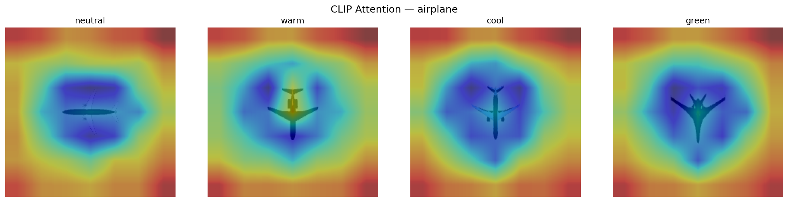
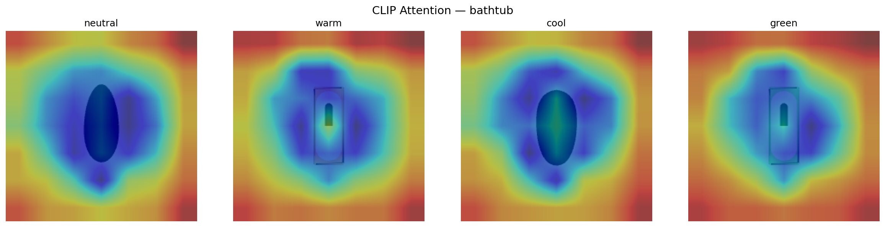
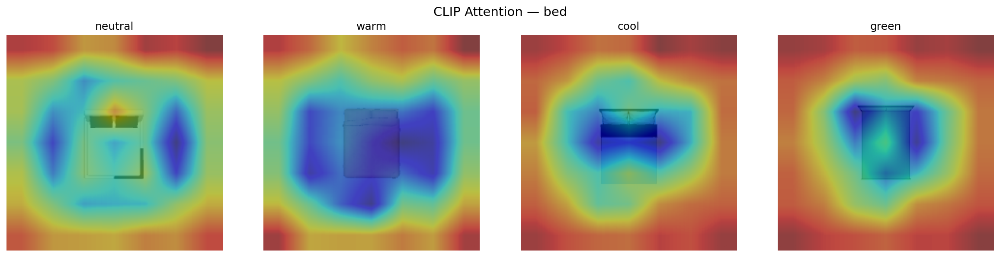

# CLIP 3D Color Shortcut Audit

A mechanistic audit of color shortcut behavior in CLIP's visual representations
applied to 3D rendered objects under controlled illumination shifts.

**Model:** CLIP ViT-B/32 | **Dataset:** ModelNet40 (10 categories, 10 objects each)
**Lighting conditions:** neutral, warm (sunset), cool (overcast), green (extreme)

---

## Phase 1 — Render Dataset

Rendered 400 images from ModelNet40 3D meshes using pyrender.
Same object, same viewpoint, four lighting colors per object.
Output: 10 categories × 10 objects × 4 lighting conditions = 400 PNG images at 224×224.

---

## Phase 2 — Linear Probe

Extracted CLIP ViT-B/32 embeddings for all 400 renders.
Trained linear classifiers to predict category and lighting condition.

| Probe | Accuracy |
|-------|----------|
| Object category | 66.2% |
| Lighting condition | 77.5% |

**Finding:** CLIP encodes lighting color more linearly separably than object
category in its final embedding. A linear classifier can identify illumination
color with higher accuracy than object identity — consistent with color
shortcut behavior in the representation space.

---

## Phase 3 — Zero-Shot Stress Test

Measured CLIP zero-shot classification accuracy under each lighting condition
using text prompts: "a photo of a {category}".

| Lighting | Accuracy |
|----------|----------|
| Neutral | 33.0% |
| Warm | 31.0% |
| Cool | 34.0% |
| Green | 32.0% |

**Finding:** Zero-shot classification accuracy is largely stable across lighting
conditions (±2%). The color encoding found in Phase 2 does not directly cause
zero-shot misclassification — CLIP's text-image similarity is partially robust
to the illumination shifts tested. The low baseline (33%) reflects a
distribution gap between minimal 3D renders and the natural images CLIP was
trained on.

---

## Phase 4 — Attention Visualization

Extracted CLS-to-patch token similarity from CLIP's final transformer block
to produce spatial attention maps for each object under each lighting condition.

**Finding:** CLIP consistently attends to object edges and silhouettes rather
than lit surfaces — the structural geometry dominates the representation.
However, attention patterns shift between lighting conditions, particularly
for complex objects (bed, bookshelf), providing visual evidence of the color
encoding measured in Phase 2. The model is not fully invariant to illumination.

**Airplane:**

**Bathtub:**

**Bed:**

---

## Summary

| Phase | Finding |
|-------|---------|
| Phase 2 | Lighting color linearly separable at 77.5% — higher than category at 66.2% |
| Phase 3 | Zero-shot accuracy stable under lighting shift — color encoding does not dominate matching |
| Phase 4 | Attention follows object geometry but shifts with lighting — partial illumination sensitivity |

**Key insight:** CLIP encodes illumination color strongly in its embedding
space but this does not catastrophically collapse zero-shot classification the
way color shortcuts collapsed re-ID matching. The shortcut is present but
partially compensated by CLIP's rich semantic training. This contrasts with
the supervised re-ID baseline where color completely dominated matching.

This connects to Gomez-Villa et al. (ICLR 2023) — Planckian jitter was shown
to counter color-crippling effects in self-supervised training. This audit
suggests CLIP exhibits residual color encoding that may be addressable through
targeted illumination augmentation during fine-tuning for 3D scene understanding tasks.
